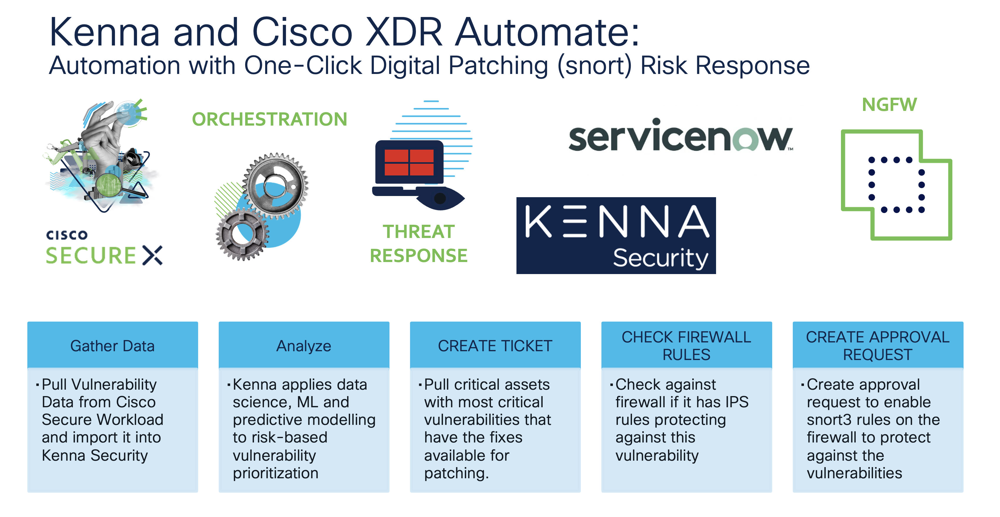

# Kenna - Secure Firewall Digital Patching Workflow

# Use Case

Use case:  Reducing risk from vulnerabilities in your infrastructure through highly automated, risk prioritized detection and response.

This workflow pulls discovered critical vulnerabilities for critical assets within Kenna Risk-based vulnerability management system, where a fix is available to remediate the vulnerabilities in question. For each fix, the ServiceNow ticket is created to kick-off remediation activity. The workflow then reaches out to Cisco Secure Firewall to discover existing Snort 3 rules that detect those CVEs. Upon approval from Security Analyst, the Snort rules are then enabled automatically in Cisco Secure Firewall to provide protection while the Patch Management Team is working on a plan to remediate vulnerabilities on critical assets.

## Installation

### Requirements

* The following system atomics are used by this workflow:
        Kenna - Get All Fixes
        Kenna - Search Vulnerabilities
        SecureX - SSE Proxy - Send Request

* The following atomic actions must be imported before you can import this workflow:
        ServiceNow - Create Incident (CiscoSecurity_Atomics)
        Service Now - Add Work Note to Incident (CiscoSecurity_Atomics)
* The targets and account keys listed at the bottom of the page
    ServiceNow

### Targets
Target Group: `Default TargetGroup`

| Target Name | Type | Details | Account Keys | Notes |
|:------------|:-----|:--------|:-------------|:------|
| CTR_API | HTTP Endpoint | _Protocol:_ `HTTPS` _Host:_ `visibility.amp.cisco.com` _Path:_ `/iroh` | None | Created by default |
| Kenna_Target | HTTP Endpoint | _Protocol:_ `HTTPS` _Host:_ `api.kennasecurity.com` _Path:_ None | None |  |
| ServiceNow | HTTP Endpoint | _Protocol:_ `HTTPS` _Host:_ `<instance>.service-now.com` _Path:_ /api | ServiceNow_Credentials | Be sure to use your instance URL |
| SXO Webhook Target | HTTP Endpoint | _Protocol:_ `HTTPS` _Host:_ `securex-ao.us.security.cisco.com`  _Path:_ `/webhooks/`| None | Refer to [documentation](https://ciscosecurity.github.io/sxo-05-security-workflows/webhooks) for more information about configuring webhooks |

### Account Keys

| Account Key Name | Type | Details | Notes |
|:-----------------|:-----|:--------|:------|
| SecureX Token | Bearer Token |  | Created by default |
| ServiceNow_Credentials | HTTP Basic Authentication | _Username:_ ServiceNow User ID _Password:_ ServiceNow Password |  |

## Configuration

### Sub-workflow configuration

1. Install the workflow from GitHub repository. The main workflow and sub-workflow will be installed into your SecureX Orchestration environment.
1. Open sub-workflow `FMC Rules Override with Approval Request`.
1. Configure the workflow with webhook trigger according to [documentation](https://ciscosecurity.github.io/sxo-05-security-workflows/webhooks).

### Main workflow configuration

1. Add your Kenna API token to the `API Token` local variable (or, if you have an API key in a global variable already, set the local variable to the global’s value using the `Fetch Global Variables` group at the beginning of the workflow)
1. Set the `Kenna Instance URL` local variable to the URL of your Kenna instance (for example: `customer.kennasecurity.com`)
1. Set the `Risk Meter Group ID` local variable to the ID of the risk meter group you want the workflow to process. You can get this by viewing the group in your Kenna console and looking at the page URL. The group ID should be after `search_id=`. For example, in this URL the group ID is 123456: `/explore?search_id=123456&name=....`
1. Set the `Risk Score Threshold` local variable to the minimum risk score you want the workflow to process. Anything with a risk score less than this value will be ignored
1. Set the `FMC Domain UUID`, `FMC Device ID` and `FMC Policy ID` local variables to configure FMC digital patching capability
1. Set the `ServiceNow User ID` local variable to the username you want incidents opened as. This can either match the username in your `ServiceNow Account Key` or, if the account has the appropriate permissions, can be a different user
1. (Optional) Update the `Ticket Limit` local variable with the maximum number of ServiceNow tickets you want the workflow to create per execution
1. By default, this workflow will not run automatically. [Click here](https://ciscosecurity.github.io/sxo-05-security-workflows/schedules/) to learn about scheduling it to run on its own

## Usage

### Workflow steps

1.    Make sure the required inputs were provided
1.    Fetch global variables
1.    Get a list of assets for the risk meter group and read them to a table
1.    Check if assets were found:
- If not, end the workflow
- If so, loop through each asset:
    - If the ticket limit has been reached, end the workflow
    - Get fixes for the asset
    - Get vulnerabilities for the asset (where a fix is available, a due date is set, and there’s no ServiceNow ticket association)
    - Parse vulnerabilities and fixes into text for ServiceNow
    - Create a ServiceNow incident
    - Loop through each CVE:
        - Update the vulnerabilities in Kenna with the ServiceNow ticket
        - Fetch Cisco Secure Firewall Snort Rules
        - Add Worknote to an Incident with Snort Rules details
        - If non-blocking rules found - initiative approval request for rules action override
        - Add Worknote to an Incident with rules action override details

## Links to DevNet Learning Labs

For more information about working with SecureX Orchestration, please visit the following [DevNet Learning Lab](https://developer.cisco.com/learning/tracks/devnet-express-security/security-securex-orchestration/).
## Notes

Please test this properly before implementing in a production environment. This is a sample workflow!

## Author

Oxana Sannikova (osanniko@cisco.com)